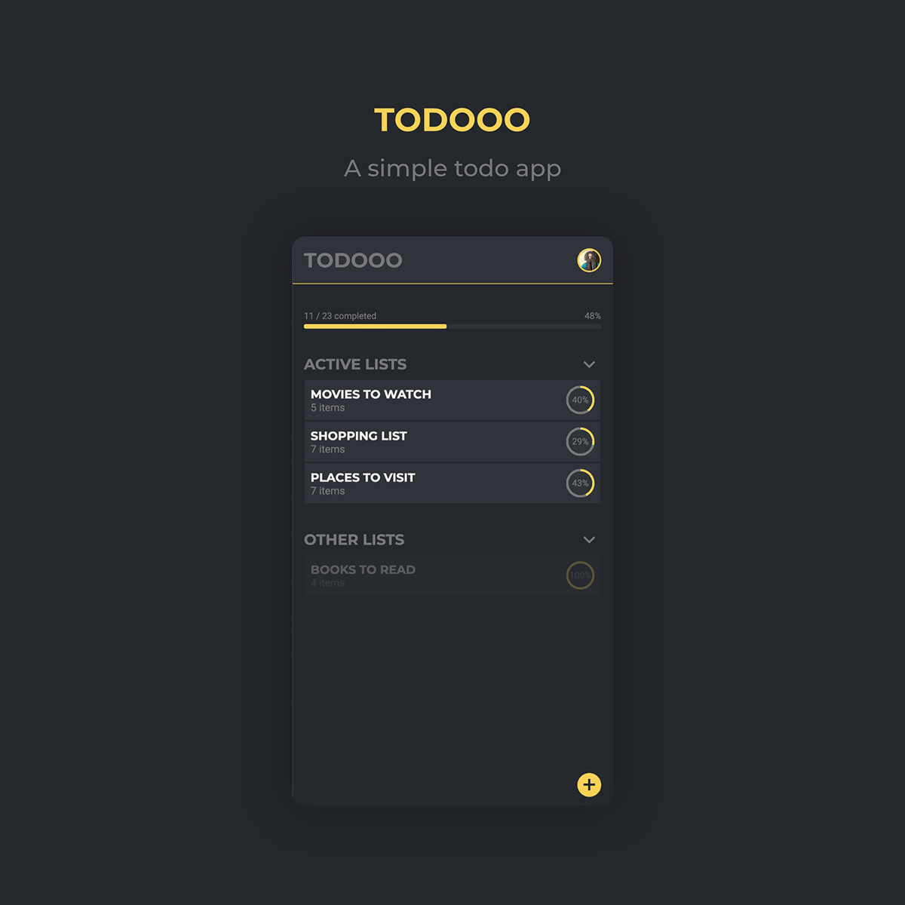

# Todooo

Todooo is a simple todo / task app i created to practice typescript. You can create lists, add todos an try to keep up with all the things you want to do!

## ⚙️ Before using
To prevent any problems i have disabled the login on the app's firestore console.
So we can use the app again we need to:
- Enable Google Authentication for the app
  - On the app firestore go to "Authentication", then go to the "Sign-in method" tab and enable "Google" provider
- Add correct Firestore configuration
  - On the `src/firestore/firestoreConfig.ts` add the correct data to the `firestoreConfig` Object
  - You can find the correct configuration data on the firestore backend, go to "Project settings" and on the "General" tab scroll down to the "Your Apps" section.

## 📦 Scripts
- `start` runs your app for development, reloading on file changes
- `start:build` runs your app after it has been built using the build command
- `build` builds your app and outputs it in your `dist` directory
- `lint` runs the linter for your project

## 📸 Inspiration
- [Taskiller](https://dribbble.com/shots/4277574/attachments/4277574-Taskiller-mobile-to-do-manager?mode=media)
- [Airbasket](https://dribbble.com/shots/6777609-Airbasket-App-Dark-Mode)
